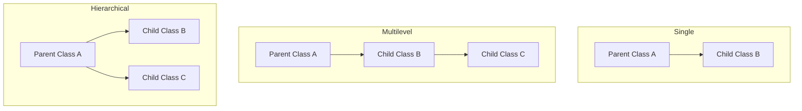

**Inheritance** is one of the key pillars of Object-Oriented Programming (OOP) in Java. It is a mechanism that allows one class (the **subclass** or child class) to inherit the attributes (fields) and methods of another class (the **superclass** or parent class).

Inheritance represents the **IS-A relationship** (also known as a parent-child relationship). For example, a Dog *IS-A* Animal, a Car *IS-A* Vehicle.

---

## Why Use Inheritance?
1. **Code Reusability:** You can reuse methods and fields of an existing class, reducing duplicate code.
2. **Method Overriding:** A child class can provide a specific implementation of a method that is already defined in its parent class (polymorphism).

---

## 1. The `extends` Keyword

In Java, we use the `extends` keyword to inherit from a class.

**Syntax:**
```java
class Superclass {
    // fields and methods
}

class Subclass extends Superclass {
    // inherited fields and methods + new fields and methods
}
```

**Example:**
```java
// Parent Class (Superclass)
class Vehicle {
    protected String brand = "Ford";

    public void honk() {
        System.out.println("Tuut, tuut!");
    }
}

// Child Class (Subclass)
class Car extends Vehicle {
    private String modelName = "Mustang";

    public static void main(String[] args) {
        Car myCar = new Car();

        // Accessing the inherited field and method
        System.out.println(myCar.brand + " " + myCar.modelName); // Output: Ford Mustang
        myCar.honk(); // Output: Tuut, tuut!
    }
}
```

> [!NOTE]
> We used the `protected` access modifier in the parent class to allow access within the subclass.

---

## 2. Types of Inheritance in Java

Java supports three primary types of inheritance:



### A. Single Inheritance
A child class inherits from a single parent class. (See the `Vehicle` and `Car` example above).

### B. Multilevel Inheritance
A class inherits from a child class, which makes it a grandchild of the original parent class.

```java
class Animal {
    void eat() { System.out.println("Eating..."); }
}

class Dog extends Animal {
    void bark() { System.out.println("Barking..."); }
}

class Puppy extends Dog {
    void weep() { System.out.println("Weeping..."); }
}
```

### C. Hierarchical Inheritance
Multiple child classes inherit from a single parent class.

```java
class Shape {
    void draw() { System.out.println("Drawing shape..."); }
}

class Circle extends Shape {
    void drawCircle() { System.out.println("Drawing circle..."); }
}

class Rectangle extends Shape {
    void drawRectangle() { System.out.println("Drawing rectangle..."); }
}
```

---

## 3. Why Multiple Inheritance is NOT Supported

In Java, a class **cannot extend more than one class**. This means multiple inheritance is not supported in Java classes.

### The Diamond Problem
If class `C` could extend both class `A` and class `B`, and both `A` and `B` have a method with the same signature (e.g., `execute()`), then calling `c.execute()` would create ambiguity because Java would not know which parent's method to call.

```
       A (execute)
      / \
     B   C (execute)
      \ /
       D  (Which execute() does D inherit?)
```

To avoid this complexity, Java does not support multiple inheritance with classes. 

> [!TIP]
> You can achieve multiple inheritance in Java using **Interfaces** (which will be covered in later guides).

---

## 4. Method Overriding

When a subclass provides a specific implementation for a method that is already defined in its superclass, it is called **Method Overriding**.

### Rules for Method Overriding:
1. The method must have the **same name** and **same parameter list** as in the parent class.
2. The method must have the **same or a covariant return type**.
3. Use the `@Override` annotation to inform the compiler that you are overriding a parent method (helps catch typos).

**Example:**
```java
class Parent {
    void display() {
        System.out.println("Parent display");
    }
}

class Child extends Parent {
    @Override
    void display() {
        System.out.println("Child display (Overridden!)");
    }
}
```

---

## 5. The `final` Keyword in Inheritance

You can use the `final` keyword to control inheritance:

- **Final Class:** A class declared as `final` **cannot be inherited** (cannot be extended).
  ```java
  final class Vehicle { ... }
  // class Car extends Vehicle { } // ❌ Compile-time Error!
  ```
- **Final Method:** A method declared as `final` **cannot be overridden** by subclasses.
  ```java
  class Vehicle {
      final void honk() { ... }
  }
  class Car extends Vehicle {
      // void honk() { ... } // ❌ Compile-time Error!
  }
  ```

---

### Next Steps ➡️
Now that you understand how classes can inherit from each other, the next topic will cover **Polymorphism in Java** to learn how objects can take multiple forms.
